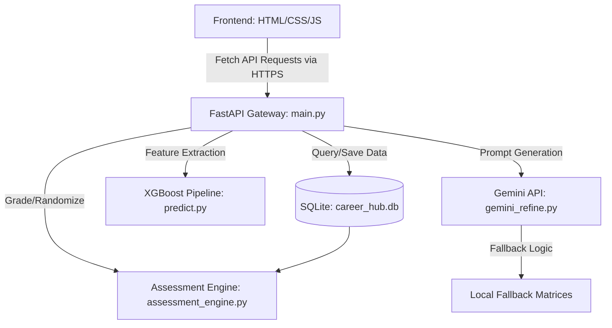
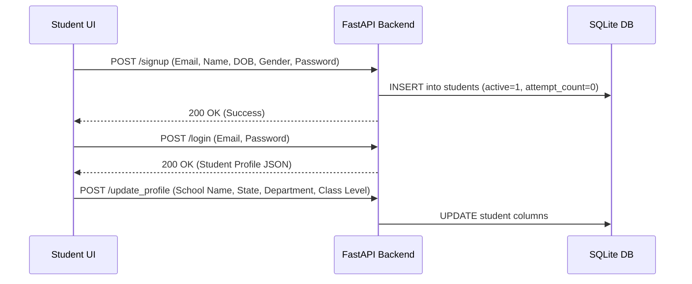
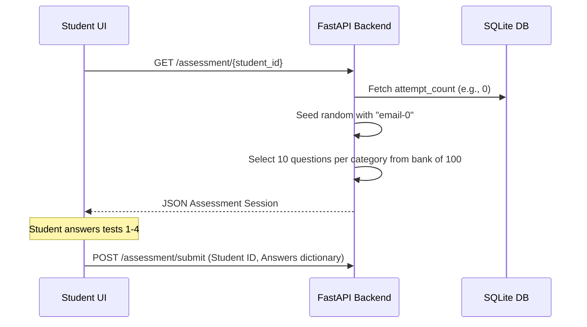
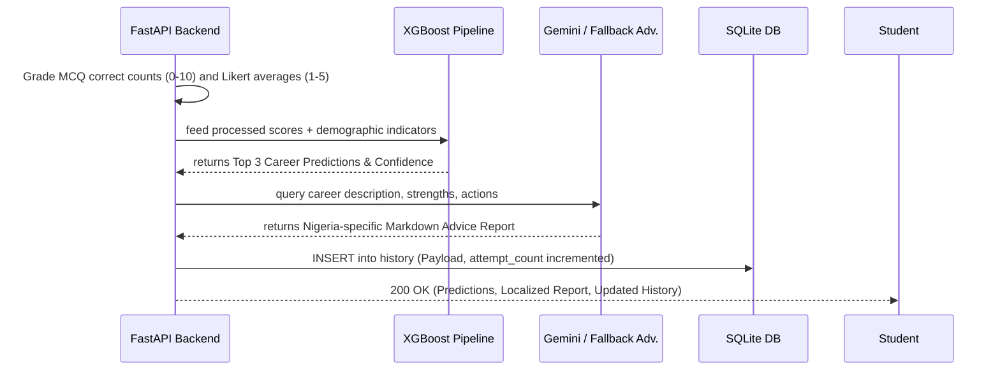

# Smart Career Predictor

## Architecture, Workflow, and Deployment Guide

This repository contains the complete system design, architecture, deployment details, and workflows for the **Smart Career Predictor App**, an AI-powered guidance platform for Nigerian secondary school students.

---

## 1. System Architecture (For Academic/Paper Reference)

The application employs a decoupled architecture separating the presentation layer (frontend) from the data processing and machine learning layers (backend). This enables high scalability and flexible deployment strategies.



### Core Components
1. **Frontend Presentation Layer (`frontend/`)**: A responsive, PWA-ready Single Page Application (SPA) built with pure HTML5, CSS3, and JavaScript. It communicates asynchronously with the backend via `fetch` API, enabling deployment on static hosting platforms like Vercel.
2. **API Gateway Layer (`backend/fastapi_integration/main.py`)**: Implements RESTful architecture using FastAPI. It manages CORS headers (allowing cross-origin requests from the decoupled frontend), handles route routing, and defines Pydantic schemas for data validation.
3. **Core Domain Logic (`assessment_engine.py`)**: Manages the psychometric testing loops, state validation, scoring mechanics, and SQLite database transactions (e.g., storing student profiles, logging assessment scores).
4. **Inference Layer (`predict.py`)**: Utilizes a serialized `scikit-learn` pipeline and an `XGBoost` classifier to evaluate student scores across multiple domains (Aptitude, Cognitive, Interest) and outputs primary, secondary, and tertiary career probability vectors across 10 defined classes.
5. **Advisory Engine (`gemini_refine.py`)**: Interfaces with the Google Gemini LLM API to interpret raw ML probabilities into a professional, human-readable mentor report. It includes graceful fallback mechanisms using local matrices to ensure system reliability even when API quotas are exceeded.

---

## 2. System Workflow

The user journey is automated through a synchronized state machine between frontend and backend:

### Step 1: Authentication & Profiling


### Step 2: Assessment Hub & Dynamic Grading


### Step 3: Inference & Report Compilation


---

## 3. SQLite Database Schema

The SQLite schema is designed to allow simple, clean scaling to Firebase or PostgreSQL:

### `students` Table
Stores student accounts, demographics, current class standing, and cumulative credentials:
*   `email` (TEXT PRIMARY KEY): Unique identifier.
*   `name` (TEXT): Full name.
*   `password_hash` (TEXT): Secure hash of the student's password.
*   `phone` (TEXT): Contact number.
*   `dob` (TEXT): Date of Birth.
*   `gender` (TEXT): Gender label.
*   `school_name` (TEXT NULL): Name of secondary school.
*   `school_type` (TEXT NULL): Public/Private indicator.
*   `state` (TEXT NULL): Nigerian state.
*   `class_level` (TEXT NULL): Current grade (`SSS 1`, `SSS 2`, `SSS 3`).
*   `department` (TEXT NULL): Academic stream (`Science`, `Arts`, `Commercial`).
*   `language` (TEXT NULL): Preferred interface language.
*   `uploaded_results` (TEXT NULL): JSON array of completed educational levels (e.g., `["SSS 1"]`).
*   `attempt_count` (INTEGER DEFAULT 0): Assessment session count.

### `history` Table
Stores chronological records of prediction payloads and reports:
*   `id` (INTEGER PRIMARY KEY AUTOINCREMENT): Row identifier.
*   `student_id` (TEXT): References `students(email)`.
*   `attempt_number` (INTEGER): Attempt index.
*   `payload` (TEXT): Complete JSON dump of test scores, predictions, and report text.
*   `created_at` (TEXT): UTC timestamp.

---

## 4. Model Evaluation & Performance Metrics

The machine learning models were trained and evaluated in [`backend/ml_models/training/new_model.ipynb`](file:///c:/Users/USER/Documents/GitHub%20uploads/smart-career-code-me/backend/ml_models/training/new_model.ipynb). The pipeline includes preprocessing (scaling numerical features, ordinal encoding categorical features) and model evaluation using 5-Fold Stratified Cross-Validation, train/test split accuracy, precision, recall, and F1-score.

`Note`: The current dataset is a synthetic dataset. The original dataset meant for the project will be generated using survey (Google Form).

### Overall Model Performance Summary

| Model | Train Accuracy | Test Accuracy | 5-Fold CV Accuracy | Precision (Weighted Avg) | Recall (Weighted Avg) | F1-Score (Weighted Avg) |
| :--- | :---: | :---: | :---: | :---: | :---: | :---: |
| **Random Forest Classifier** | 100.00% | 100.00% | 100.00% ± 0.00% | 1.00 | 1.00 | 1.00 |
| **XGBoost Classifier (Base)** | 100.00% | 100.00% | N/A | 1.00 | 1.00 | 1.00 |
| **XGBoost Classifier (Tuned - Production)** | **100.00%** | **100.00%** | **99.50% ± 1.00%** | **1.00** | **1.00** | **1.00** |

*Note: Hyperparameter tuning via `RandomizedSearchCV` achieved a Best Cross-Validation score of **99.38%** with the tuned parameters: `n_estimators=500`, `learning_rate=0.2`, `max_depth=5`, `gamma=0.2`, `subsample=1.0`, `colsample_bytree=0.8`.*

### Detailed Classification Report (Tuned XGBoost Production Model on Test Set)

| Class | Precision | Recall | F1-Score | Support |
| :---: | :---: | :---: | :---: | :---: |
| **Agriculture and Environmental Sciences** | 1.00 | 1.00 | 1.00 | 5 |
| **Business & Finance** | 1.00 | 1.00 | 1.00 | 6 |
| **Computer Science & IT** | 1.00 | 1.00 | 1.00 | 2 |
| **Creative Arts & Design** | 1.00 | 1.00 | 1.00 | 3 |
| **Education & Humanities** | 1.00 | 1.00 | 1.00 | 3 |
| **Engineering & Technology** | 1.00 | 1.00 | 1.00 | 3 |
| **Entrepreneurship & Management** | 1.00 | 1.00 | 1.00 | 4 |
| **Law & Social Sciences** | 1.00 | 1.00 | 1.00 | 6 |
| **Mass Communication & Media** | 1.00 | 1.00 | 1.00 | 5 |
| **Medicine & Health Sciences** | 1.00 | 1.00 | 1.00 | 3 |
| **Accuracy** | | | **1.00 (100.00%)** | **40** |
| **Macro Average** | **1.00** | **1.00** | **1.00** | **40** |
| **Weighted Average** | **1.00** | **1.00** | **1.00** | **40** |

### Top Predictive Feature Importances (XGBoost Production Model)

| Rank | Feature Name | Importance Weight |
| :---: | :--- | :---: |
| 1 | `aptitude_score_10` | 0.0865 (8.65%) |
| 2 | `economics` | 0.0762 (7.62%) |
| 3 | `financial_accounting` | 0.0729 (7.29%) |
| 4 | `cgpa` | 0.0709 (7.09%) |
| 5 | `chemistry` | 0.0676 (6.76%) |
| 6 | `creative_arts` | 0.0608 (6.08%) |
| 7 | `cognitive_score_10` | 0.0566 (5.66%) |
| 8 | `marketing` | 0.0541 (5.41%) |
| 9 | `government` | 0.0529 (5.29%) |
| 10 | `christian_religious_studies/islamic_studies` | 0.0520 (5.20%) |

---

## 5. Verification Results

A suite of unit and integration tests was written and executed inside the project's virtual environment:

### Command Run:
```bash
python -m pytest backend/ml_models/tests/test_backend.py -v --tb=short
```

### Results Summary:
*   **Total Tests**: 6
*   **Status**: `PASSED`
*   **Duration**: 41.07 seconds
*   **Covered Sections**:
    1.  `test_prediction_returns_structure`: Verifies XGBoost classifier outputs predicted career, confidence score, and top 3 path listings.
    2.  `test_assessment_session_contains_questions`: Confirms dynamic random question allocation fetches exactly 10 questions per category.
    3.  `test_grading_logic`: Validates mathematical grading bounds (Aptitude/Cognitive scored 0-10, Psychometric/Personality scaled 1-5).
    4.  `test_signup_login_flow`: Tests secure endpoints, credential validation, and duplicate signup errors.
    5.  `test_profile_update_and_submit`: Tests end-to-end integration mapping frontend JSON profiles directly into SQLite writes and grading predictions.

---

## 6. Identified Lapses and Recommended Improvements

| Area | Lapsed Behavior | Proposed Improvement |
| :--- | :--- | :--- |
| **API Keys** | Google Gemini key credentials are flagged as leaked/blocked. | Add an active API-key check on startup. Log warnings to let site admins know when falling back to offline advice. |
| **Database Coupling** | Direct SQL execution inside `assessment_engine.py`. | Abstract database operations using a Repository Pattern. This makes it trivial to swap SQLite for Firebase Firestore or PostgreSQL. |
| **Error Handlers** | Frontend fetch calls log to console upon network failure. | Implement visually clean modal cards or retry buttons on the UI to gracefully handle temporary network dropouts. |
| **Test Platforms** | Automation browser subagents require Linux containers. | Shift to platform-agnostic headless tests (e.g. Playwright with bundled Chromium binaries) for cross-platform validation. |

## 7. Deployment Workflow

Because of the decoupled nature of the application, we deploy the **Frontend** and **Backend** separately.

### A. Frontend Deployment (Vercel)

The frontend is a completely static set of files that makes network requests to the backend. It has been configured to dynamically resolve the backend URL based on its environment (localhost vs production).

**Steps to Deploy to Vercel:**
1. Commit all your code and push it to a new public repository on GitHub.
   ```bash
   git init
   git add .
   git commit -m "Initial commit"
   git branch -M main
   git remote add origin https://github.com/yourusername/your-repo-name.git
   git push -u origin main
   ```
2. Log in to [Vercel](https://vercel.com) and click **Add New** > **Project**.
3. Import your GitHub repository.
4. Set the **Framework Preset** to `Other`.
5. Set the **Root Directory** to `frontend/` (or leave as root if `index.html` is in the root directory).
6. Click **Deploy**. In a few seconds, your frontend will be live on a Vercel-provisioned domain.

### B. Backend Deployment (Docker & Render)

The backend runs Python, FastAPI, and machine learning pipelines, requiring a dedicated server environment. We use **Docker** to containerize this environment, guaranteeing it behaves identically to your localhost.

**Docker Architecture:**
- `Dockerfile`: Defines a lightweight `python:3.10-slim-bullseye` image, installs the system compilers required for XGBoost, installs dependencies from `requirements.txt`, and boots the `uvicorn` server.
- `docker-compose.yml`: Facilitates local testing of the containerized setup.

**Steps to Deploy to Render:**
1. Create a free account on [Render.com](https://render.com).
2. Click **New +** and select **Web Service**.
3. Connect your GitHub repository.
4. Render will automatically detect the `Dockerfile` in your repository.
5. Ensure the **Environment** is set to `Docker`.
6. Add your Environment Variables under the **Advanced** tab:
   - `GOOGLE_API_KEY` = `your_gemini_api_key_here`
7. Click **Create Web Service**. 
8. Render will build the Docker container and provide you with a live URL (e.g., `https://smart-career-backend.onrender.com`).

### C. Linking the Frontend and Backend
Once your backend is live on Render:
1. Open `frontend/smart-career-predictor.html`.
2. Locate the `API_BASE_URL` variable at the top of the script section.
3. Update the production fallback URL to your new Render URL:
   ```javascript
   const API_BASE_URL = window.location.hostname === 'localhost' || window.location.hostname === '127.0.0.1' ? '' : 'https://smart-career-backend.onrender.com';
   ```
4. Commit and push this change to GitHub. Vercel will automatically trigger a new deployment, and your live frontend will now communicate securely with your live Docker backend!

---

## 8. Functionality Assurance (Localhost vs Production)

By utilizing `CORSMiddleware` in the FastAPI backend (`allow_origins=["*"]`) and the dynamic `API_BASE_URL` in the frontend, **the application will function exactly as it did on localhost**. 
- On `localhost`, the frontend will continue to send requests to `` (relative paths), seamlessly hitting your local Python server.
- On `Vercel`, it will append the Render URL to all requests, successfully bypassing cross-origin restrictions and delivering identical performance and behavior.